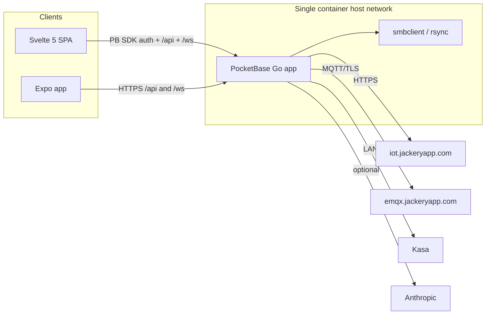

# Unify into a single PocketBase app

## Target

One Docker service, one Go binary (PocketBase used as a framework, not the stock binary + JS hooks). That process serves the dashboard, talks to Jackery HTTP + MQTT, runs smart/solar charge, Kasa, backup, and AI jobs, and stores data in PocketBase’s SQLite. Watchtower and the `jackery-bridge` container go away.

JS `pb_hooks` cannot do long-lived MQTT or python-kasa, so this is a **Go rewrite** of the Python domain (`cloud_client.py`, `bridge.py`, `server.py`, `energy_db.py`, `forecaster.py`, `smart_charge.py`, `solar_charge.py`, `automation.py`, `kasa_client.py`, backup, advisor).

## What stays, what changes

**Keep:**
- Expo app in [`mobile/`](mobile/) — update it to PocketBase tokens, do not rebuild the native UI in this project
- JSON shapes of today’s FastAPI **feature** routes and `/ws` snapshot protocol (Svelte and Expo both consume them)
- Host networking (SMB LAN scan + Kasa UDP discovery still need the real LAN)
- Encrypted-at-rest secrets on disk (AES-GCM), not plaintext PocketBase fields
- GHCR publish on push to `main` ([`.github/workflows/docker-publish.yml`](.github/workflows/docker-publish.yml))
- Compose image pin: `image: jackerymonitor:latest` with `pull_policy: never` (local/retag workflow). Do not switch this to the GHCR image name.

**Remove / replace:**
- Vanilla PWA [`web/index.html`](web/index.html), [`web/app.js`](web/app.js), [`web/login.html`](web/login.html), [`web/style.css`](web/style.css) — replaced by a Svelte 5 SPA
- `jackery-bridge` service, TCP JSON-RPC on `:8766`, [`device_client.BridgeDeviceClient`](device_client.py)
- Watchtower service, docker.sock, `com.centurylinklabs.watchtower.enable` labels
- Split `command: python server.py` vs `python bridge.py`
- Custom HMAC dashboard auth ([`auth.py`](auth.py), [`api_auth.py`](api_auth.py), `jackery_session` cookie, `/api/auth/login|setup|logout|me|change_password`)

**Accepted tradeoff:** Jackery credentials live in the same process as the HTTP server. Isolation was the old reason for the bridge; unification drops that.

## PocketBase shape

Use current PocketBase as a library (`github.com/pocketbase/pocketbase`, pin a current 0.36.x). Layout:

- [`cmd/jackery/main.go`](cmd/jackery/main.go) — `pocketbase.New()`, `OnServe` routes, `app.Cron()` plus long-lived goroutines (MQTT cannot be cron)
- `internal/jackery`, `internal/energy`, `internal/forecast`, `internal/smartcharge`, `internal/solarcharge`, `internal/automation`, `internal/kasa`, `internal/backup`, `internal/advisor`, `internal/api`, `internal/migrate`
- `pb_migrations/` — collection definitions
- `ui/` — Svelte 5 + Vite SPA (PocketBase JS SDK). Production build emits into `pb_public/`
- `pb_public/` — built dashboard, served last via `apis.Static` with index.html fallback for client routing
- Data dir `/data` (`pb_data` inside it) so the existing volume keeps working

**Collections (document / config):** `users` (dashboard login), `devices`, `app_settings` (one record), `automation_rules`, `kasa_devices`, `smart_charge_config`, `solar_charge_config`, `location`, `cost_plan`, `events`, `algorithm_suggestions`, `algorithm_changes`.

**Time-series as extra SQL tables in the same SQLite** (not collections): port [`energy_db.py` SCHEMA](energy_db.py) (`samples`, `forecast_predictions`, `*_decisions`, `weather_*`, `battery_packs`, `daily_solar_summary`, `automation_firings`, `device_params`). High-volume minute buckets need composite PKs and `GROUP BY`; PocketBase list APIs are a poor fit. Custom routes query via `app.DB()`.

**Admin UI** stays at `/_/`. Dashboard login is the `users` collection, not `_superusers`. First-run also creates a matching superuser (same email/password) so `/_/` works without a second account; dashboard XSS then cannot use superuser APIs because custom app routes authenticate as `users`, and the PWA never stores a superuser token.

### PocketBase authentication

Dashboard identity is native PocketBase auth via the **PocketBase JS SDK** in the new Svelte app. Do not wrap it in a custom session cookie or keep `login.html`.

- **Collection:** `users` with password auth. Keep today’s username/password UX (not a forced email). Enable a unique `username` identity field (PocketBase auth-with-password `identity`); email can be optional/`{username}@local` if the collection still requires it.
- **Single-user:** `OnRecordCreateRequest` allows the first unauthenticated create, then rejects further signups. After that, only the owner can `PATCH` their own record (password change via PB’s `oldPassword` + `password`).
- **Svelte login:** `pb.collection('users').authWithPassword(username, password)`. `pb.authStore` is the session (localStorage). Setup uses `pb.collection('users').create(...)` when the collection is empty. Logout is `pb.authStore.clear()`. Refresh is `pb.collection('users').authRefresh()`.
- **API calls:** custom `/api/*` send `Authorization: Bearer ${pb.authStore.token}`. Go routes use `apis.RequireAuth()`. Do not depend on a `pb_auth` cookie for the dashboard.
- **WebSocket:** `/ws?token=` with `pb.authStore.token`; reject if `e.Auth` is missing.
- **Expo:** same PB token in SecureStore and Bearer header (auth endpoints only; native screens stay).
- **First run:** empty `users` → Svelte `/setup` route. Unauthenticated `/api/*` returns `{detail: "setup_required"}` so the SPA can route there.
- **Password change:** Settings calls `pb.collection('users').update(id, { oldPassword, password, passwordConfirm })`.
- **Name clash:** keep `/api/auth/status|credentials|forget` for **Jackery cloud** credentials only (not dashboard login). Do not put dashboard auth under `/api/auth/`.
- **Cloudflare Access:** optional edge SSO. Svelte on boot, if `!pb.authStore.isValid`, `GET` a small `/api/auth/cf` that verifies `Cf-Access-Jwt-Assertion`, finds/creates a `users` record, and returns a RecordAuth JSON payload the client saves with `pb.authStore.save(token, record)`. LAN hits without the assertion use username/password.
- **Public paths:** Svelte login/setup routes (static), `/api/collections/users/auth-with-password`, `/api/auth/cf`, `/api/backup/setup_restore/*`. Everything else requires `RequireAuth()`.
- **Drop:** HMAC `jackery_session`, PBKDF2 `auth.json`, custom `/api/auth/login|setup|logout|me|change_password`.

Existing NAS `auth.json` hashes cannot be imported (PBKDF2 vs PocketBase bcrypt). Migrator copies the username/email into a pending flag; first boot after cutover is a one-time password reset via `/setup`. Jackery/Kasa/AI encrypted files are unrelated and migrate as-is.

### Svelte 5 dashboard

Rebuild the web UI as a **Vite + Svelte 5 SPA** (not SvelteKit SSR). PocketBase serves static files only; client routing needs `apis.Static` index.html fallback.

- New tree: `ui/` (`@sveltejs/vite-plugin-svelte`, `pocketbase` SDK). `npm run build` writes to `pb_public/`.
- Dev: Vite on :5173 with proxy `/api` and `/ws` to the Go `serve` process.
- Docker: extra Node build stage copies `pb_public` into the runtime image.
- **Look:** port the current dark dashboard visual language (Live / Energy / Forecast / Device / Automation / Logs / Settings), not a unrelated redesign. Port the power-flow, charts, and fleet strip behavior tab-for-tab.
- **Auth gate:** root layout checks `pb.authStore`; unauthenticated → login or setup. No custom HMAC, no `login.html`.
- **PWA:** keep installability (`manifest.webmanifest` + service worker caching the Svelte shell, never `/api` or `/ws`).
- **Expo is out of this rebuild.** Mobile keeps its screens; only the token source changes.
- Delete vanilla `web/` once the Svelte app covers the same tabs.

Implement Svelte components with the Svelte 5 runes API and validate with the Svelte MCP autofixer when writing `.svelte` files.

### Reserved `/api` paths

PocketBase owns `/api/collections`, `/api/files`, `/api/realtime`, `/api/health`, `/api/settings`, `/api/backups`, `/api/logs`, `/api/crons`. Our app already uses **`GET/POST /api/settings`** ([`server.py` ~5101](server.py), [`web/app.js`](web/app.js), [`mobile/src/api/client.ts`](mobile/src/api/client.ts)) — that collides with PB instance settings (admin UI needs it).

Rename the app tunables API to **`/api/tunables`** (Svelte + Expo). Keep `/api/backup/*` (singular); PocketBase uses `/api/backups` (plural). The Svelte app uses the PocketBase SDK **only for auth** (`users` collection). Feature data stays on custom `/api/*` via Go DAO, not collection REST.

Custom `/ws` is free (PB realtime is `/api/realtime`). Register static `/{path...}` last so it does not steal `/api` or `/_/`.

## Runtime (replaces two loops)

Long-lived goroutines started on serve (not cron), with `app.Cron()` for wall-clock jobs:

- Jackery HTTP poll (`cloud_poll_interval_s`) + MQTT subscribe (same split as today: MQTT is ip/op/temp; HTTP still required for SOC, ports, AC/car input — see [`cloud_client.py` L44–49](cloud_client.py))
- Energy integration + WS fan-out (`poll_interval_s`)
- Smart charge every 5 min; solar charge every 30s; Kasa reconciler 5–30 min backoff
- Hourly forecast recorder; daily backup at `backup_schedule_hour`; optional advisor at `advisor_trigger_hour`
- Cloud session watchdog (~10 min stale)

Mock backend stays as `JACKERY_MOCK=1` / `--mock` for UI work without Jackery.

**Kasa is the highest-risk port.** Today we only need `discover`, `status`, `set_state`, and power reading ([`kasa_client.py`](kasa_client.py)), but newer plugs need KLAP + cloud credentials. Milestone: Go client for those four ops. If KLAP stalls, a tiny in-image Python helper just for Kasa is the escape hatch — everything else stays Go.

macOS Keychain host-bridge goes away; Linux-style encrypted files under `/data` everywhere.

## Deploy: one service, no Watchtower

Collapse [`docker-compose.yml`](docker-compose.yml) to a single `jackery-monitor` service:

- Keep `image: jackerymonitor:latest` and `pull_policy: never` exactly as today (local/retag; compose must not pull)
- `network_mode: host`, `PORT` / `--http=0.0.0.0:${JACKERY_HTTP_PORT:-8123}`
- Volume `jackery-data:/data`
- Healthcheck: HTTP GET on the dashboard port (no `:8766`)
- Still install `smbclient`, `rsync`, `openssh-client` in the runtime image
- Multi-stage Dockerfile: Node builds `ui/` → `pb_public/`; `golang` builds the binary (`CGO_ENABLED=0`); debian-slim runtime with `smbclient` / `rsync` / `openssh-client`

Same collapse for [`docker-compose.build.yml`](docker-compose.build.yml) and [`docker-compose.dev.yml`](docker-compose.dev.yml) (one service; `mac` profile becomes “run the binary on the host” or “compose with mock”).

**Watchtower replacement (no docker.sock):** do not add Diun, another updater container, or `pocketbase update` (that only updates stock PB, not this custom binary).

Simplest NAS-native option: **Container Manager → Image → Get latest version**, retag to `jackerymonitor:latest` if needed, then Project → Restart. Do not use `docker compose pull` — `pull_policy: never` is intentional. Optional Task Scheduler can retag + `docker compose up -d` on the host (no docker.sock in a sidecar). GHCR still publishes on push to `main`; compose just will not pull it itself. Update [`README.md`](README.md) auto-deploy section and drop Watchtower troubleshooting notes.

## Data migration (existing NAS volumes)

On first boot, if `/data/energy.db` / JSON configs exist and PB collections are empty, run `internal/migrate`:

- Import SQLite tables into the new SQL schema
- Map `settings.json`, `automation.json`, `smart_charge.json`, `solar_charge.json`, `kasa_devices.json`, `location.json`, `cost.json` → collections
- Copy encrypted cred files as-is (`jackery-creds.json`, `kasa-creds.json`, AI/backup keys)
- Do not import `auth.json` as a working password (hash algorithm mismatch). Surface the old username on `/setup` and require a new password once
- Leave originals in place (rename to `*.legacy`) until a successful login + energy totals sanity check

## Implementation order (shippable slices)

Do not attempt a single-PR rewrite of ~5.6k lines of `server.py` plus ~1.4k of `bridge.py` plus forecast/smart-charge. Each milestone should be runnable.

1. **Skeleton** — Go module, Dockerfile (Node + Go stages), single-service compose, PocketBase `users` auth + `RequireAuth`, `/api/tunables`, healthcheck, Watchtower removed.
2. **Svelte shell** — Vite + Svelte 5 app with SDK login, setup, auth gate, layout/nav matching today’s tabs, PWA manifest. Empty tab bodies until APIs exist. `ui/` proxies to Go in dev.
3. **Cloud live path** — port [`cloud_client.py`](cloud_client.py) (AES-ECB + RSA login, device list/property, MQTT). `/api/status`, `/api/set_output`, pause/resume, `/ws`. Svelte Live tab (fleet strip, power flow, outputs). First cutover that can replace both containers for live viewing.
4. **Energy + devices** — aggregator, history/totals/daily, battery packs; Svelte Energy + Device tabs.
5. **Forecast + weather + location + cost** — Svelte Forecast tab.
6. **Smart charge + solar charge + inverter watchdog** — Svelte Automation charge cards.
7. **Kasa + automation + reconciler** — Svelte Automation + Logs.
8. **Backup (smbclient/rsync) + AI advisor** — Svelte Settings.
9. **Migrator, CI (Go tests + `ui` build), delete Python and vanilla `web/`, README/CHANGELOG.** Expo: swap session store to PB token only.

Until the Go live path and Svelte Live tab exist, the current Python stack remains the production path; the new app lives alongside in-tree.

## CI

Replace pytest-on-Python image with: Go test + `go build` + `ui` production build, keep docker-publish. Port the high-value tests in [`tests/test_forecaster.py`](tests/test_forecaster.py), [`tests/test_smart_charge.py`](tests/test_smart_charge.py), [`tests/test_energy_db.py`](tests/test_energy_db.py), [`tests/test_automation.py`](tests/test_automation.py), [`tests/test_auth.py`](tests/test_auth.py), [`tests/smoke_cloud.py`](tests/smoke_cloud.py) rather than every Python file.
